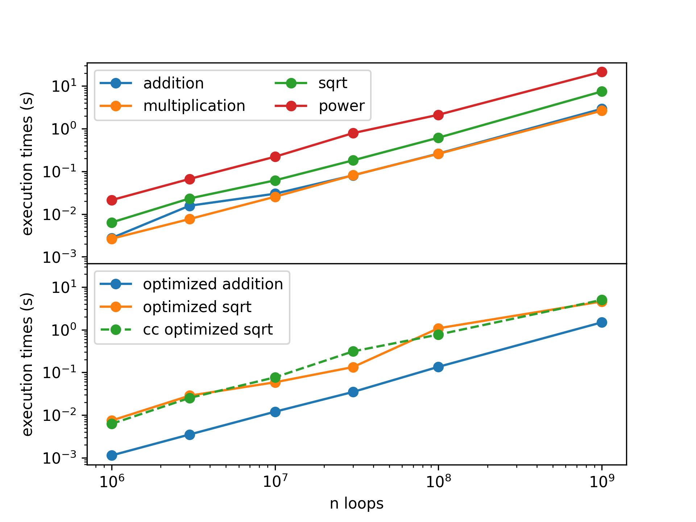

# Fred Angelo Garcia | P. Set #1 | ASTR415 | FAll 2022
> Visit github.com/fred144/astr415/tree/main/hws/hw_1_garcia
> for a full rendered version of this file. 
> 
## Compilation 
#### Pre-requisites
```console
GNU bash, version 5.0.17(1)-release (x86_64-pc-linux-gnu)
python 3.8.10 
matplotlib
numpy
gcc (Ubuntu 9.3.0-17ubuntu1~20.04) 9.3.0
```
#### The compressed folder should contain the precompiled code. However, you can rebuild it by doing the following
```console
user~$ make clean
user~$ make all
user~$ ./hw1_bash.sh
```

## Commentary and Answers 

Here is the plot for the final results. I show it here since I will reference it in the following. 


<!--  -->

---
## Q1
**(a)**  Write a shell script to construct a table of execution times for double-precision addition and multiplication as a function of n for n = $10^6$, (3) $10^6$, $10^7$, (3) $10^7$, $10^8$, (3) $10^8$, and $10^9$. Do the square-root and raise-to-the-power functions give much different execution times? Comment.

> Refering to the figure, we see that the power laws (slope) share a pretty similar exponent. That is, the rate that execution times increase as a function of loop count is pretty similar for all operation types. However, it is noticable that the addition and multiplication, which are both native operations in C, have a lower y intercept. But the ones we had to import via `#include <math.h>`, have higher intercepts and shows that they both have consistently higher executuion times. This is consistent with the fact that if you are import a new model, that model is probably based on current native operations that are used to write a more complicated (therfore more resource heavy) job.  

**(b)** Plot the data in the table, execution time as a function of n, using any plotting
package you like. The axes should use a logarithmic scale. Estimate the number of floating-point additions and multiplications (MFLOPs) your code carried out on average per second. 

> See the plot above. In lecture we define MFLOPS – “million floating-point operations per second”. 
We have the following data, see .dat files if desired. Notice, we'll consider the $n = 10^6$ since this is conveniently a million operations, roughly.  

| Operation     | n loops      |time (s)            |
| ------------- |:------------:| -----:             |
| addition      | $10^6$       |  2.754000000000e-03 |
| multiplication| $10^6$       |  2.652000000000e-03 |

> We just take the ratio to see how many million loops, each constituting to an operation, the program can do in one second. 

$\mathrm{mflops_{addition}} = 10^6 / (2.654 \times 10^{-3}) = 2.654 \times 10^9 \rightarrow \sim 30 \mathrm{GFlops}$ 

$\mathrm{mflops_{multiplication}} \sim 30 \mathrm{GFlops}$

**(c)**  Redo one or more plots in question 1b after recompiling your code with optimizations
turned on (e.g., try the “-O2” compiler flag) and plot the results. Is there a difference? Also try a different compiler if possible, with and without optimizations (e.g., if you used gcc, try icc next. Comment on the results and suggest why differences exist.

> See bottom panel of the plot. I did this using `-O3` optimization for both `gcc` and `cc` compilers. The optimization does make a difference. More noticably so for the sqrt. `gcc` vs `cc` differnce is less noticable though. The results makes sense since optimizing it shuould make the run times smaller. This flag is not a free lunch, however, compilation time suffers a little for the benefit of the run time of the program. In terms on why certain compilers might be better, some compilers are built within a certain native framework. So, an intel based compiler will most likely run better on intel machines. 

## Q2 
How long did it take you to finish this problem set?
>Longer than I hoped it would have. Around 5 hrs. There are a lot of moving parts. I need to write the bash script, the c program, the python plotting script, and this writeup that you are reading. 
