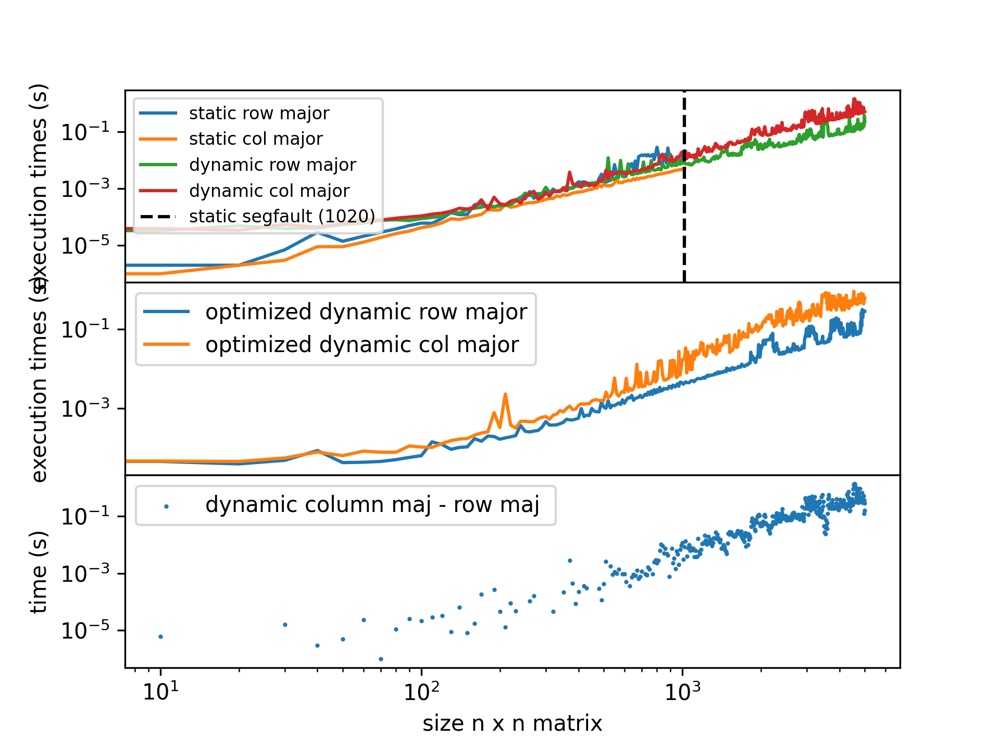

# Fred Angelo Garcia | P. Set #2 | ASTR415 | FAll 2022
Visit [github.com/fred144/astr415/tree/main/hws/hw_1_garcia](github.com/fred144/astr415/tree/main/hws/hw_1_garcia) for a full rendered version of this file. 

## Compilation 
#### Pre-requisites
```console
GNU bash, version 5.0.17(1)-release (x86_64-pc-linux-gnu)
python 3.8.10 
matplotlib
numpy
gcc (Ubuntu 9.3.0-17ubuntu1~20.04) 9.3.0
```
The compressed folder should contain the precompiled code. 

However, you can rebuild it by doing the following.
```console
user~$ make clean
user~$ make all
user~$ ./hw2_bash_script.sh 
```
## Commentary and Answers 


<!--  -->

*This plot shows a couple of things. First, is that dynamic allocation doesn't really matter that much in terms of performance at big matrix sizes. However, it just allows for larger matrix sizes. The obvious thing this graph also shows is that $C$ is a row-major based language, so having the fast index be the column causes the program to run consistently faster. This means that we are filling the memory sequentially as we go by doing it row major.*


### Problem 1
(a) *First define the array as a static array (e.g., double A[N][N];). How large can N
be before you encounter a problem at runtime ? Explain what happens and how
can you increase N further.*
> See the plot above. Using static array preallocates the intended matrix size before we start filling it in with values. We get segfault when the matrix is $1020 \times 1020$. $N \sim 1020$ is the limit mostly dictated by our memory. Or, more specifically, we've hit the memory limit allocated to the program by filling in our static array with more values (in this case I just appended 2 for each index) than our memory allocation. We can work arround this by either increasing our stack size (physically or increasing the limit). Or, we can just use **heap**. Since heap limit is set on application startup, but *can grow as space is needed*. Otherwise, I've used double precision floating poitns, so this can be float instead to save on memory usage.  

(b) *Next, use dynamical allocation of memory (with malloc). Knowing the difference
in execution times between case (A) and (B) for a set of N values, given the clock
speed can you determine the size of the cache and/or the hit rate? Explain your
reasoning.*
> We define the following in lecture. • Memory request to cache which is satisfied 
is called a “hit”. •Memory request which must be passed to 
next level is called a “miss”. •Fraction of requests which are hits is called 
the “hit rate”

>Note, we can calculate the discrepancy with the row and column major ways of filling the arrays. In the python script, this is done by `print(dy_rmajor[:,1].max() - dy_cmajor[:,1].max()`. See plot, this is around 1.0058479999999999 seconds for $N=5000$.  Given that clockspeed is the amount of cycles per second, one can estimate using the following. The diverging rate can be attributed to the cache misses. Cache misses should approache an asymptotic value but we do not approach that since it takes too long to go any higher than N = 5000 on my machine.

> I used a double array (8 bytes), with  $5000 \times 5000 = 25,000,000$ elements. This equtes to 200000000 bytes, or 200 MB. Given that effective access time $= (HR) t_{cache} + (1-HR) t_{pm}$. If we were given the clock speed, it is basically what effective access time is. We can solve for HR, the hitrate by knowing the cache time and time to access primarry memory. Note, we can also use the fact that this 200 MB matrix fits into a the stack to estimate the cache, placing a lower bound of at least 200 MB. In fact, this isn't so far off. My Intel *i3 6100* has a cache of 300 MB. Close enough. In theory we can calculate the hit rate given the time discrepancy above. This is how I would start it. It does not tell us to explicitly derive it, so I wont.

(c) *Finally, compile with -O2 optimization and compare the execution times for a
large value of N. Comment on the results.*
> At large $N$, even with optimization, the difference between the row major and column major does really become obvious. This would get more noticable since C prefers row major, so if your optimize C using C optimization, it would obviously optimize its natural preference.

### Problem 2 
*Explain any discrepancy. Which method is preferable? What happens when you repeat this
exercise in double precision?*

>We get the following output. You can get this by running ./quad_form
```
Single floating point precision
         Using direct computation of both roots
         first root: 4.999000000000e+03  
         second root: 2.000400127145e-04  
         Using larger root 
         second_root: 2.000400127145e-04  
Double floating point precision
         Using direct computation of both roots
         first root: 4.998999799960e+03  
         second root: 2.000400158977e-04  
         Using larger root 
         second_root: 2.000400160064e-04  
```
>As you can see there isn't much difference between using the larger root vs. calculating the root directly. But, I would think that this may be due to poor precision if it does happend. However, I would think that doing it the second method is preferred from a performance point of view since it only uses native operations (e.g., /, *, +, -) instead of the math package to use things like pow() or sqrt(). Using double precision also gives us different answers (slightly). This added precision is mostlikely the reason why we start to see the divergence between the calculated values of the smaller roots. Note, we also encounter more sigfigs for the larger root. This makes sense since float can hold up to 7 decimal digits accurately while double can hold up to 15. You have to make the tradeoff between memory usage and accuracy. There is no free lunch.  