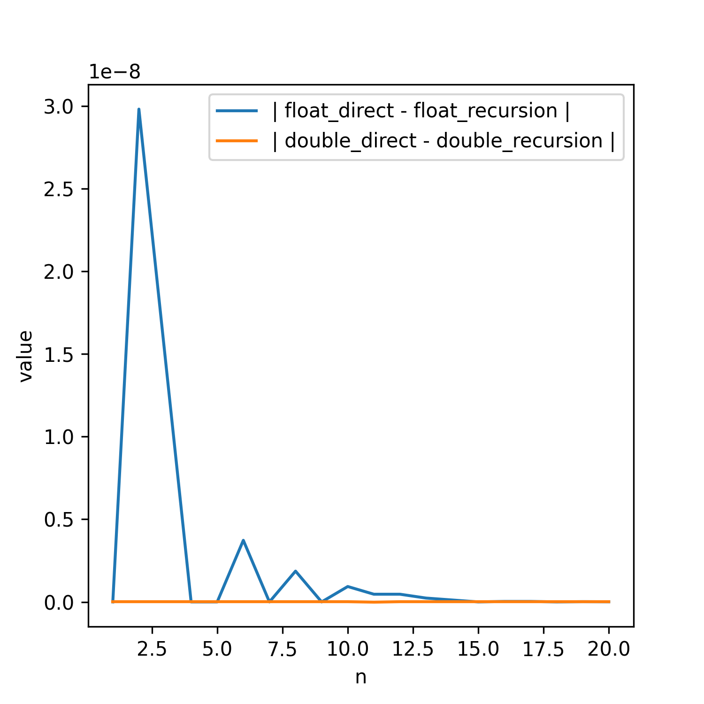

# Fred Angelo Garcia | P. Set #3 | ASTR415 | FAll 2022
Visit [github.com/fred144/astr415/tree/main/hws/hw_3_garcia](github.com/fred144/astr415/tree/main/hws/hw_3_garcia) for a full rendered version of this file. 

## Compilation 
#### Pre-requisites
```console
GNU bash, version 5.0.17(1)-release (x86_64-pc-linux-gnu)
python 3.8.10 
matplotlib
numpy
gcc (Ubuntu 9.3.0-17ubuntu1~20.04) 9.3.0
```
The compressed folder should contain the precompiled code. 

However, you can rebuild it by doing the following.
```console
user~$ make clean
user~$ make all
user~$ ./hw3_bash.sh 
```
## Commentary and Answers 

 

<!--  -->

*Left is for problem 1 and right is for problem 2*

### Problem 1
(a) *Is the round-off error random? What happens in double precision?*
> Round off error is not random. If we compare with the direct computation vs the backwards recursion relation, for lower n, there is more discrepancy between direct computation vs the recursion relation. Why is this? A characteristic of an unstable algorithm is that the error depends on the number of iterations. So, the error is not random. See the graph above. For the tables, look into the float.dat and double.dat for single and double precisions, respectively. Note, the columns are n, recursion, and  direct. In double precision, we increased our sigfigs so the difference is not noticable. Increasing the precision of the values may aid in taming unstable algorithms. 


### Problem 2

We define *I*

$I = \begin{pmatrix}r_x^2+r^2_{y\:}+\:r_z^2&0&0\\ \:0&r_x^2+r^2_{y\:}+\:r_z^2&0\\ \:0&0&r_x^2+r^2_{y\:}+\:r_z^2\end{pmatrix}-\begin{pmatrix}r^2_{x}&r_xr_y&r_xr_z\\ r_yr_x&r^2_{y}&r_yr_z\\ r_zr_x&r_yr_z&r_z^2\end{pmatrix}$

We can simplify this to 

$= \begin{pmatrix}r^2_{y\:}+\:r_z^2&-r_xr_y&-r_xr_z\\ \:-r_yr_x&r_x^2+\:r_z^2&-r_yr_z\\ \:-r_xr_z&-r_yr_z&r_x^2+r^2_{y\:}\end{pmatrix}$ 

Where, for each element, you perform the given operation for one particle and sum it for all particles. 

(a) *What is the spin period in hours?*
> After carrying through the operations, we get the following output:
```Total Angular Momentum Vector
-3089.874756 -240.005966 -923897.000000 
The values of the associated reduced vector is 
-1.05803e-05 4.0486e-06 -0.000405253 
Here is the tensor
1.05814e+09 7.38004e+08 -1.26285e+07 
7.38004e+08 1.73974e+09 -1.29503e+06 
-1.26285e+07 -1.29503e+06 2.28012e+09 
With the corresponding omega = 0.000405 s^-1 
We calculate a period of = 15498.308594 s 
Or 4.305086 hrs 
```

(b) See the image above. 
> The position of the particle are plotted, with the colors indicating the **magnitude of the velocity** of the given particle. There appears to be two spherical objects that are in the process of mergin? The outer parts are, of course, moving faster than the inner parts. 